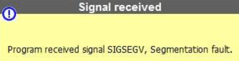
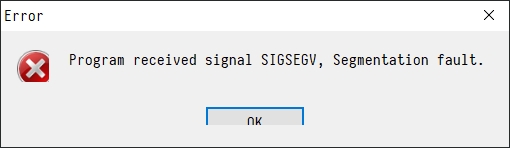

# ACM中一些常见的问题及原因

最近在 ACM 群灌水，顺便解决了一点问题，感觉可能会成为日经系列，寻思可以写个博文专门写写，正好也是对自己学习知识的检验。

我觉得这篇文章阅读方式可以按照《C语言常见问题集》，遇到问题了来看看也行，电脑阅读的时候右边应该会有个目录可以跳转，顺着读一遍也行。

文章只能慢慢更新，因为我并不想随意地对待这种难得的问题，然而工作在身并不能全身心投入。

以下内容如无特殊声明，采用C99和C++11标准。

<!--more-->

## 为什么在读入的时候不加&经常会 RE，但是数组名不加&就没问题？

我们直接来看一段代码：

```c
#include <stdio.h>

int main()
{
	int a;
	scanf("%d", a);
	return 0;
}
```

编译运行的结果基本是`Segmentation fault (core dumped)`，如果是在windows上用codeblocks、devcpp之类的写的程序，多半会看到或者如果是devcpp，还可能是在一段时间的无响应后退出，同时返回值是一个大得惊人的数字

这里我们需要对比一下`a`和`&a`的区别，我们先直接把它们打印出来看一下。

```c
#include <stdio.h>

int main()
{
	int a;
	printf("%x\n%x\n", a, &a); 
	return 0;
}
```

`%x`的意思是按十六进制打印，运行我们应该会看到类似如下的结果：

```bash
➜  ./format
0  ## 这里值不一定，也可能不是0
f35ab98c ## 这里的值也不一定，但是通常会很大，比如这个十六进制转成十进制就是‭3759417480‬
```

这里我们再进一步，做一个测试，首先我们改写程序，其次用系统工具查看一下系统调用。

先介绍一下我们用到的工具：

`echo`是能将输入原样输出的一个程序，如果下面是一个运行的例子：

```bash
➜  echo 12341234
12341234
```

`ltrace`是一个能跟踪库函数调用的工具，也就是说它能追踪到你程序调用的库里的类似`scanf`、`printf`这样的函数并且把调用函数的参数打印出来。

然后我们对下面这段程序使用上面写的工具，把`1234 1234`作为输入喂给程序。

```c
#include <stdio.h>

int main()
{
	int a;
	printf("%d", a);
	printf("%d", &a);
	scanf("%d", &a);
	scanf("%d", a);
	return 0;
}
```

运行结果如下：

```bash
➜  echo "1234 1234" | ltrace ./format
printf("%d", 0)                                             = 1
printf("%d", -787805524)                                    = 10
__isoc99_scanf(0x7fa859609004, 0x7fffd10b0aac, 0x7fa85959d8c0, 0) = 1
__isoc99_scanf(0x7fa859609004, 1234, 0x7fa85959d8d0, 16 <no return ...>
--- SIGSEGV (Segmentation fault) ---
+++ killed by SIGSEGV +++
```

我们可以看到，`printf`打印出了`a`的值，也就是`0`，同时第一个赋值没有出错，将`a`改为了1234，但是接下来的一行代码又出现了1234这个数字`__isoc99_scanf(0x7fa859609004, 1234, 0x7fa85959d8d0, 16 <no return ...>`。重复实验并且改变输入的数字，会发现这一行调用函数的第二个参数总是我们输入的第一个数字，也就是第一次给a赋值并成功的结果。

学过操作系统的同学或者对计算机组成有所了解的同学会知道，程序运行时的各种所需都是存储在内存里的，变量也不例外，而它们在内存里都是有个地址的。基于这些知识和刚才实验的结果，我们可以推测，`scanf("%d", a);`是将a的值认为是一个指针的地址并尝试向里面写入数据，但是a的默认值并不一定是一块给写数据的内存空间，这时候就引发了一个错误。

接下来让我们到`scanf`的[manual page](http://man7.org/linux/man-pages/man3/scanf.3.html)看看描述。

这里我把关键的两段截出来，其他部分对这个问题帮助不大所以就自己看了。重点看加粗部分

>        The scanf() family of functions scans input according to *format* as
>        described below.  This format may contain *conversion specifications*;
>        the results from such conversions, **if any, are stored in the
>        locations pointed to by the *pointer* arguments that follow format**.
>        Each pointer argument must be of a type that is appropriate for the
>        value returned by the corresponding conversion specification.
> 
>        **If the number of conversion specifications in format exceeds the
>        number of pointer arguments, the results are undefined.  If the
>        number of pointer arguments exceeds the number of conversion
>        specifications, then the excess pointer arguments are evaluated, but
>        are otherwise ignored.**

这里format指的是[格式化字符串](https://en.wikipedia.org/wiki/Printf_format_string)，简单来说就是printf/printf的第一个参数，fscanf/fprintf的第二个参数，而这个字符串里的conversion specifications（中文维基直译为转换说明）就是指指定类型的那个e/p/d/x，比如%d中的d。同时从这里可能也就能理解为什么要叫printf/scanf而不叫print/scan，因为这是print format/scan format的简写。顺便一提，格式化字符串还是一类漏洞的名称，有兴趣的话不妨搜索了解一下。

然后回到话题，看到第一处加粗的文字，也就是说，若里面有类似%d这样的参数，而且也有对应的参数（比如`scanf("%d", a)；`里的a就是%d对应的参数）scanf会按照格式读入数据（并将其转化为二进制表示），然后存入对应**指针**参数指向的地址。也就是说它把后面的参数认为是指针了。

这里C语言熟练的朋友就知道，局部自动(auto)变量定义时候不会隐式初始化，所以a的值是不确定的，把它直接给scanf用的结果大抵相当于向野指针指的地方写数据。所以段错误什么的很正常吧，

那么为什么下面这段代码不会出错呢？

```c
#include <stdio.h>

int main()
{
	int a[1];
	printf("%d", a);
	printf("%d", &a);
	scanf("%d", &a);
	scanf("%d", a);
	return 0;
}
```

> 因为数组名是常量指针。

肯定有认真听课的这样回答，但是很遗憾，不是的。数组名不是指针，但是它的确被转换成了指针。具体的内容可以搜索《说出来你们可能不信，但是数组名确实不是指针常量》。但是这个东西并不太重要，如果不当语言律师也没打算深度钻研C，也没有必要理解。

## 在函数里开不了大数组吗？

这里我们继续用代码做实验

```c
#include <stdio.h>

int main()
{
	int a[524288];
	printf("OK\n");
	return 0;
}
```

编译运行，程序多半并不能让我们看到`OK`，而是会出现和前面一样的情况，也就是段错误。（如果没出现就把这个数字翻几倍就能看到效果了）。

简单来说的话，函数中声明定义的非全局、非static，且没有使用`*alloc`、`new`产生的变量都会被放在栈上，栈的大小由编译选项决定，在我的电脑上大致就是能开500,000个int的大小。也可以在OJ上测试一下栈的大小，但同时并不建议在栈上开这么大，在ACM中还是全局的数组比较好用。

## 我开了一个很大的全局数组，但是编译无法通过，这是为什么？

编译器会阻止你开一个大小超过size_t表达范围的数组，也就是`sizeof`不会超过表达范围导致溢出的范围。而size_t是一个和平台相关的数据结构，在32位Linux机下，有以下结果：

```bash
root@vultr:~# cat test.c
#include<stdio.h>
int a[10000000000];
int main()
{
        printf("%d\n%d",sizeof(size_t),sizeof(long long));
        return 0;
}

root@vultr:~# gcc test.c  -o test
test.c:2:5: error: size of array ‘a’ is too large
 int a[10000000000];
     ^
```

而在64位Linux机下：

```bash
root@vultr:~# cat test.c
#include<stdio.h>
int a[10000000000];
int main()
{
                printf("%d\n%d",sizeof(size_t),sizeof(long long));
                        return 0;
}

root@vultr:~# gcc test.c -o test
root@vultr:~# cat test2.c
#include<stdio.h>
int a[10000000000000000000];
int main()
{
                printf("%d\n%d",sizeof(size_t),sizeof(long long));
                        return 0;
}

root@vultr:~# gcc test2.c -o test2
test2.c:2:5: error: size of array ‘a’ is too large
 int a[10000000000000000000];
     ^
```

## 我开了一个稍小一些的全局数组，为什么编译还是失败了而且错误的原因非常复杂？

把错误名单上下拉动找一下，通常能看到下图类似的东西，说明你遇到的正是我现在要说的这个问题：


首先需要了解的知识是一个可执行文件的文件格式，在Windows上的是PE文件格式（包括`.exe`、`.dll文`件），Linux上则是ELF文件。不过这里不做深入解析，大家只需要知道这些文件的一个构成部分是各种节。

在Linux上使用`size`这个工具可以查看ELF文件的各个节的大小，这里我们准备三份代码，编译并使用size查看。

```c
// where_is_global.cpp
#include<stdio.h>
int a[1024];
int main()
{
	printf("%OK");
	return 0;
}
```

```c
// where_is_global2.cpp
#include<stdio.h>
int a[2048];
int main()
{
	printf("%OK");
	return 0;
}
```

```c
// where_is_global3.cpp
#include<stdio.h>
int a[1024] = {0};
int main()
{
	printf("%OK");
	return 0;
}
```

```bash
$ size where_is_global
   text    data     bss     dec     hex filename
   1467     584    4128    6179    1823 where_is_global
$ size where_is_global2
   text    data     bss     dec     hex filename
   1467     584    8224   10275    2823 where_is_global2
$ size where_is_global3
   text    data     bss     dec     hex filename
   1467     584    4128    6179    1823 where_is_global3
```

可以看到区别仅在于bss所对应的数字，也就是说默认情况下，全局变量在编译后文件存放于.bss节，这也就是出现问题的原因。

默认情况下gcc对节的大小做了限制，如果超过的情况下就会出现这样的错误。但是这个是可以通过编译选项调整的，所以在不同的OJ上可能有不同的结果，在不同的环境下也不一定都能触发这个错误，下面是一份能在我的电脑上（Windows10 1903 Build, devcpp）触发的代码：

```c
#include<stdio.h>

int a[1000000000000000000L];

int main()
{
	printf("%dK\n",0);
	return 0;
}

```

## 我开了一个很大的全局数组并且通过了编译，可是为什么程序运行依然RE了？（等待更好的答案）

这里我也没有一个十分确定的答案，先直接给一个在我电脑上可以触发这样错误的程序

```c
#include<stdio.h>

static int a[1000000000000L];

int main()
{
	printf("%dK\n",a[1000000000L - 1]);
	return 0;
}
```

接下来我们深入到程序编译成的汇编代码里调试看一下，发现RE是出现在

后来找了办法确定了RAX里存放的是数组的地址，但是除此之外也不知道为什么会出这个错。

我理解来电脑不应该分配那么多内存，也就是分配阶段就应该出问题了，而不是在写东西的时候才有问题。

---

和[yuki nagato](https://github.com/Yuki-Nagato)讨论有了一个新的猜测

> yuki nagato
> 关于这个问题，我觉得应该是因为未初始化的全局变量位于bss段，系统在程序开始执行时只是记录了它的大小，没有给它实际分配内存
>
> yuki nagato
> 在首次访问的时候，系统会给它分配全零的页面，这时候会触发相关的错误
>
> CSUwangj
> 嗯嗯，感觉你说的有道理
>
> CSUwangj
> 这样子的话，我想想有没有办法验证
>
> CSUwangj
> 似乎直接调试windows可能可以验证这个

但是由于本人调试Windows经验不足，验证期限无限期延长...欢迎大牛帮帮忙提提PR

## 为什么越界会导致 RE？

一句话回答就是，越界写会导致向不该写的地方写入数据。

详细展开的话，如果是对函数里的局部变量进行了越界写，那么可能会破坏程序运行时的调用栈，导致返回地址改变，这类情况也可以归结为栈溢出，而且这个名称同时也对应了历史上一类很有名的漏洞——[栈溢出漏洞](https://www.52pojie.cn/thread-974510-1-1.html)。

如果是对static变量、局部变量、使用new或者\*alloc分配的变量进行越界写，因为它们分配在堆上，造成的问题也就是堆溢出，同样的，堆溢出也对应了[堆溢出漏洞](https://cloud.tencent.com/developer/article/1083866)。

除此之外还有一种情况就是OJ的编译器对于越界做了特殊的判断，导致一旦出现越界写程序就会强制报错并结束，这样的情况虽然越界写没有对程序运行造成影响，也还是报了RE。

## 为什么有时候越界不会 RE 但是会 TLE/WA？

在[第一个问题](#为什么在读入的时候不加&经常会 RE，但是数组名不加&就没问题？)中我们看到了，对程序进行的赋值操作其实也就是对对应内存的写入操作（不考虑利用寄存器优化的情况），同时我们可以用`printf("%p", &a);`这样的语句来查看变量a所在内存的地址。那么有以下代码：

```c
#include<stdio.h>

int main()
{
	int a[16], b[16], t;
	printf("%p %p %p\n", &a, &b, &t);
	for(int i = 0; i < 34 ; ++ i){
		a[i] = i;
	}
	for(int i = 0; i < 16 ; ++ i){
		printf("%d ", a[i]);
	}
	printf("%d\n", t);
	return 0;
}
```

已知第一行输出为`000000000062FD90 000000000062FDD0 000000000062FE14`，那么第二行输出是什么？（不要忘记考虑在我电脑上`sizeof(int)==4`）

答案是`16 17 18 19 20 21 22 23 24 25 26 27 28 29 30 31 33`


虽然变量在内存里的布局在C语言中是未定义的，但是通常来说它们根据情况（是否在同一函数、是否是全局/static变量、是否通过new/\*alloc分配）占据一片空间的相邻位置。在这样的情况下越界写就会改变相邻变量的内容，于是导致WA（恰好改变了答案）、TLE（改变了循环用的计数器）也就不难理解了。

## 我只定义过一个 left，为什么编译器告诉我`[Error] reference to 'left' is ambiguous`？

如果你仔细查看报错信息，应该会看到类似

```
916	3	{PATH}	[Note] std::ios_base& std::left(std::ios_base&)
```

出现这种问题是因为引入的头文件中的变量，比如left这个是在`bits/ios_base.h`里，而`algorithm`里有count这样的函数。

这些变量通常都在有两种方法可以解决，一是不要使用`using namespace std;`这个语句，另一个是不要用类似`left`, `count`这样的名称。从工程角度来说，第一个做法是比较合理的。

## \[Error\] ld returned 1 exit status是什么错误？

一个C语言源代码到可执行文件之间需要经过预处理、编译、汇编、链接几个过程，ld(Linux)或者ld.exe(Windows)是GCC使用的链接器。

这个错误只是说明了链接器运行失败，但是具体的错误要向上找一两行才知道是为什么，这里举几个常见的例子：（欢迎补充）

## additional relocation overflows omitted from the output


见[我开了一个稍小一些的全局数组，为什么编译还是失败了而且错误的原因非常复杂？](#我开了一个稍小一些的全局数组，为什么编译还是失败了而且错误的原因非常复杂？)

## undefined reference to `WinMain'


缺少main函数，通常是因为把main打成了mian

## cannot open output file [这里是个路径]: Permission denied


没有关闭正在运行的程序导致ld无法更新编译出来的.exe

## 总是说的堆栈，是指什么？是数据结构里的堆和栈吗？

这里指的是操作系统里的堆栈，和数据结构里的堆、栈不是一个东西。

这些前置知识能在《计算机组成原理》《操作系统》这样的书籍里找到，这里因为笔者学艺不精，不敢妄言，如果有大牛愿意贡献这部分的内容，欢迎在[repo](https://github.com/CSUwangj/ACM_Weird_Problem)里提PR。

## 参考资料

- scanf manual page
  - <http://man7.org/linux/man-pages/man3/scanf.3.html>
- 格式化字符串
  - <https://en.wikipedia.org/wiki/Printf_format_string>
- 如何调整GCC编译程序的默认栈大小
  - http://www.cplusplus.com/forum/general/134645/
- Why is the maximum size of an array “too large”?
  - https://stackoverflow.com/a/42575849
- GCC compile option
  - https://gcc.gnu.org/onlinedocs/gcc-4.6.0/gcc/i386-and-x86_002d64-Options.html#i386-and-x86_002d64-Options
- 栈基础 & 栈溢出 & 栈溢出进阶
  - https://www.52pojie.cn/thread-974510-1-1.html
- 0Day技术分析-4-堆溢出原理
  - https://cloud.tencent.com/developer/article/1083866